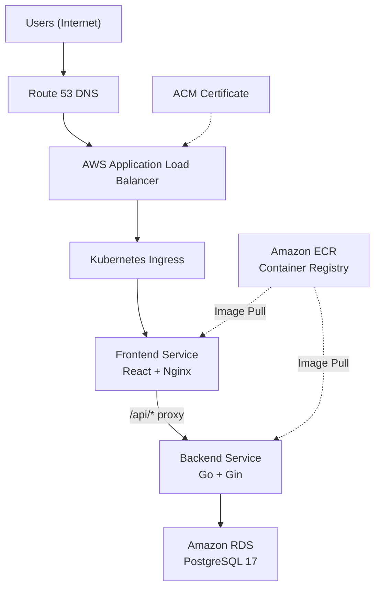
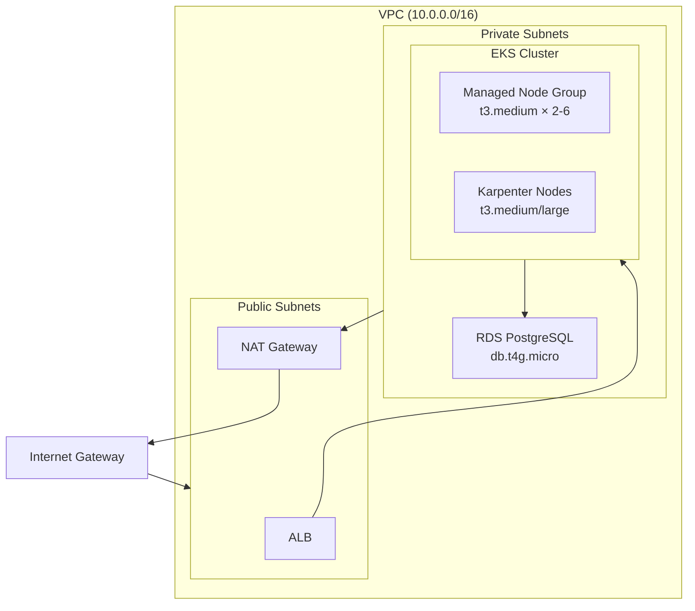
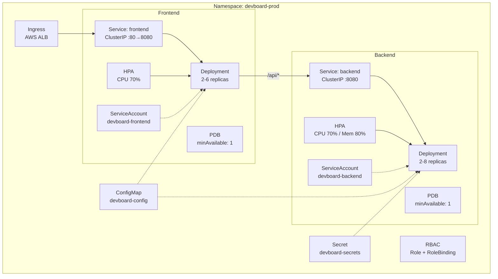
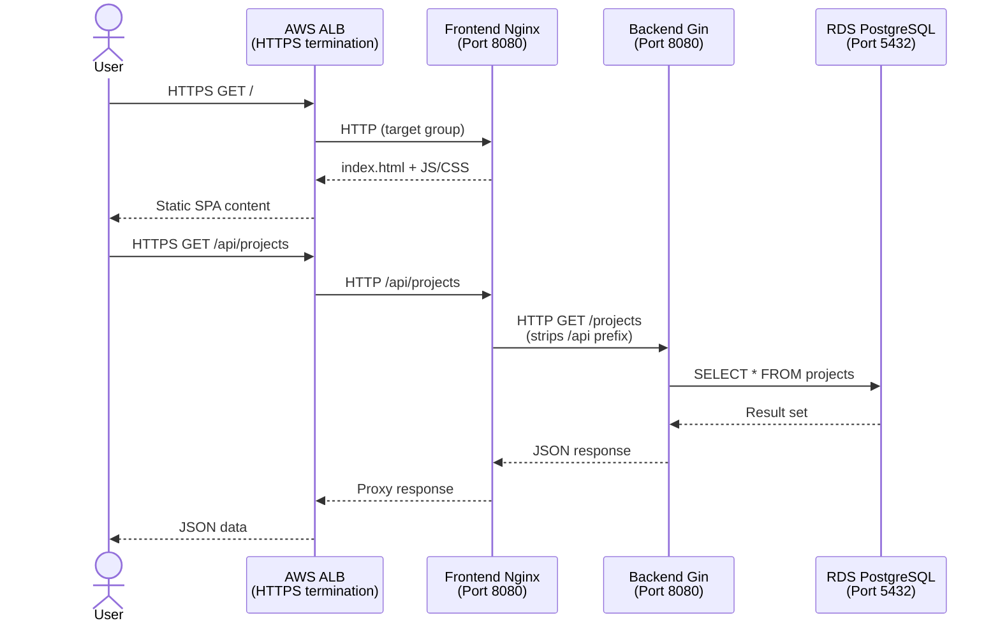
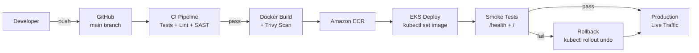
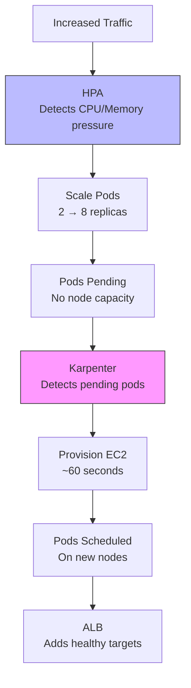

# DevBoard — EKS Architecture

## Overview

DevBoard is deployed on AWS EKS as a two-tier web application with an external managed database. The frontend (React/Nginx) serves static assets and proxies API calls to the backend (Go/Gin), which connects to Amazon RDS PostgreSQL.

---

## High-Level Architecture



---

## AWS Infrastructure



---

## Kubernetes Architecture



---

## Request Flow



---

## CI/CD Pipeline



---

## Scaling Architecture



### Scaling Parameters

| Component | Min | Max | Trigger | Scale-Down Window |
|-----------|-----|-----|---------|-------------------|
| Backend pods | 2 | 8 | CPU > 70% or Memory > 80% | 5 minutes |
| Frontend pods | 2 | 6 | CPU > 70% | 5 minutes |
| Karpenter nodes | 0 | (CPU 20 / Mem 40Gi) | Pending pods | Consolidation: 60s |
| EKS node group | 2 | 6 | Managed by EKS | N/A |

---

## Security Architecture

### Network Security

| Layer | Control | Description |
|-------|---------|-------------|
| VPC | Private subnets | Worker nodes and RDS in private subnets |
| VPC | NAT Gateway | Outbound internet via NAT (no inbound) |
| ALB | Security groups | Only ports 80/443 from internet |
| EKS nodes | Security groups | Only traffic from ALB and inter-node |
| RDS | Security groups | Only port 5432 from EKS node SG |
| TLS | ACM + ALB | HTTPS termination at ALB, TLS 1.3 policy |

### Application Security

| Layer | Control | Description |
|-------|---------|-------------|
| Container | Non-root | Backend: UID 10001, Frontend: UID 101 |
| Container | Read-only FS | `readOnlyRootFilesystem: true` |
| Container | Drop caps | `capabilities.drop: [ALL]` |
| Container | No escalation | `allowPrivilegeEscalation: false` |
| Container | Seccomp | `RuntimeDefault` profile |
| IAM | IRSA | Pod-level IAM via service accounts |
| Secrets | K8s Secrets | Migrate to AWS Secrets Manager for production |
| Images | Immutable tags | Git SHA tags, no `latest` in production |
| Images | Scanning | Trivy scan on every build |

---

## Architecture Decisions

| # | Decision | Choice | Alternative | Rationale |
|---|----------|--------|-------------|-----------|
| 1 | Database | Amazon RDS | PostgreSQL StatefulSet | 2-table schema; managed backups, HA, patching eliminate operational overhead |
| 2 | Node autoscaling | Karpenter | Cluster Autoscaler | ~60s provisioning vs ~5min; native EC2 Fleet API; better bin-packing |
| 3 | Image registry | Amazon ECR | GHCR / DockerHub | Native EKS integration; IAM auth; image scanning; lifecycle policies |
| 4 | Load balancer | AWS ALB | NLB / nginx-ingress | HTTP/HTTPS routing; ACM integration; path-based rules; AWS-managed |
| 5 | TLS termination | ACM + ALB | cert-manager | Free auto-renewing certs; no in-cluster cert management |
| 6 | Ingress routing | ALB → Nginx → Backend | ALB path-based split | Preserves existing nginx proxy; zero application code changes |
| 7 | Secrets | K8s Secrets | External Secrets Operator | Simple baseline; ESO documented for production hardening |
| 8 | Container runtime | Distroless / nginx-unprivileged | Standard images | Minimal attack surface; non-root by default |
| 9 | IaC | Terraform | CloudFormation / CDK | Multi-provider; mature module ecosystem; declarative |
| 10 | CI/CD | GitHub Actions | ArgoCD / FluxCD | Matches existing CI/CD; simple kubectl-based deploys |

---

## Network Architecture

```
┌─────────────────────────────────────────────────────────────────┐
│                        AWS Region                               │
│                                                                 │
│  ┌───────────────────────────────────────────────────────────┐  │
│  │                    VPC (10.0.0.0/16)                      │  │
│  │                                                           │  │
│  │  ┌─────────────────────┐  ┌─────────────────────┐       │  │
│  │  │  Public Subnet AZ-a │  │  Public Subnet AZ-b │       │  │
│  │  │  10.0.101.0/24      │  │  10.0.102.0/24      │       │  │
│  │  │                     │  │                     │       │  │
│  │  │  ┌───┐  ┌───┐      │  │  ┌───┐              │       │  │
│  │  │  │ALB│  │NAT│      │  │  │ALB│              │       │  │
│  │  │  └───┘  └───┘      │  │  └───┘              │       │  │
│  │  └─────────────────────┘  └─────────────────────┘       │  │
│  │                                                           │  │
│  │  ┌─────────────────────┐  ┌─────────────────────┐       │  │
│  │  │  Private Subnet AZ-a│  │  Private Subnet AZ-b│       │  │
│  │  │  10.0.1.0/24        │  │  10.0.2.0/24        │       │  │
│  │  │                     │  │                     │       │  │
│  │  │  ┌────────────────┐ │  │  ┌────────────────┐ │       │  │
│  │  │  │  EKS Node      │ │  │  │  EKS Node      │ │       │  │
│  │  │  │  ┌──┐ ┌──┐     │ │  │  │  ┌──┐ ┌──┐    │ │       │  │
│  │  │  │  │FE│ │BE│     │ │  │  │  │FE│ │BE│    │ │       │  │
│  │  │  │  └──┘ └──┘     │ │  │  │  └──┘ └──┘    │ │       │  │
│  │  │  └────────────────┘ │  │  └────────────────┘ │       │  │
│  │  │                     │  │                     │       │  │
│  │  │  ┌───┐              │  │                     │       │  │
│  │  │  │RDS│ (primary)    │  │  (standby if Multi-AZ) │    │  │
│  │  │  └───┘              │  │                     │       │  │
│  │  └─────────────────────┘  └─────────────────────┘       │  │
│  └───────────────────────────────────────────────────────────┘  │
│                                                                 │
│  ┌──────┐  ┌──────┐                                            │
│  │ ECR  │  │ ACM  │                                            │
│  └──────┘  └──────┘                                            │
└─────────────────────────────────────────────────────────────────┘
```

---

## Data Flow

| Flow | Path | Protocol | Auth |
|------|------|----------|------|
| User → App | Internet → ALB → Nginx → Static files | HTTPS → HTTP | None (public) |
| User → API | Internet → ALB → Nginx → Backend → RDS | HTTPS → HTTP → TCP | None (public API) |
| Image pull | ECR → EKS Node | HTTPS | IAM (node role) |
| DB connection | Backend pod → RDS | TCP/5432 | Password (POSTGRES_URL) |
| Metrics | Pods → Metrics Server → HPA | Internal | K8s RBAC |
| Logs | Pods → stdout → CloudWatch (optional) | Internal | IAM |

